# 콘서트 예약 서비스 아키텍쳐

## ERD
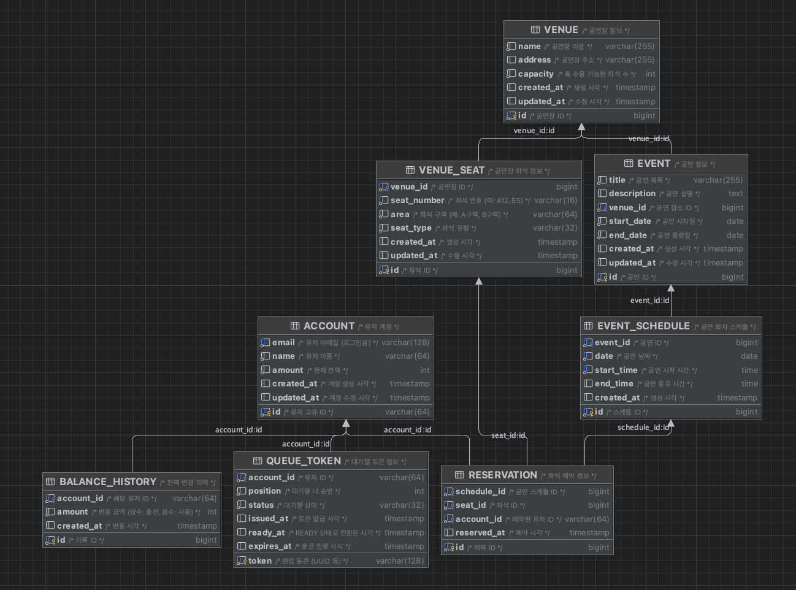
```sql
-- 유저 계정 정보
CREATE TABLE ACCOUNT
(
   id         VARCHAR(64) PRIMARY KEY COMMENT '유저 고유 ID',
   email      VARCHAR(128) NOT NULL UNIQUE COMMENT '유저 이메일 (로그인용)',
   name       VARCHAR(64)  NOT NULL COMMENT '유저 이름',
   amount     INT          NOT NULL COMMENT '현재 잔액',
   created_at TIMESTAMP DEFAULT CURRENT_TIMESTAMP COMMENT '계정 생성 시각',
   updated_at TIMESTAMP DEFAULT CURRENT_TIMESTAMP ON UPDATE CURRENT_TIMESTAMP COMMENT '계정 수정 시각',
   unique (email)
) COMMENT='유저 계정';

-- 잔액 변동 내역
CREATE TABLE BALANCE_HISTORY
(
   id         BIGINT AUTO_INCREMENT PRIMARY KEY COMMENT '기록 ID',
   account_id VARCHAR(64) NOT NULL COMMENT '해당 유저 ID',
   amount     INT         NOT NULL COMMENT '변동 금액 (양수: 충전, 음수: 사용)',
   created_at TIMESTAMP DEFAULT CURRENT_TIMESTAMP COMMENT '변동 시각'
) COMMENT='잔액 변경 이력';

-- 대기열 토큰 관리 테이블
CREATE TABLE QUEUE_TOKEN
(
   token      VARCHAR(128) PRIMARY KEY COMMENT '랜덤 토큰 (UUID 등)',
   account_id VARCHAR(64) NOT NULL COMMENT '유저 ID',
   position   INT         NOT NULL COMMENT '대기열 내 순번',
   status     VARCHAR(32) NOT NULL COMMENT '대기열 상태',
   issued_at  TIMESTAMP DEFAULT CURRENT_TIMESTAMP COMMENT '토큰 발급 시각',
   ready_at   TIMESTAMP COMMENT 'READY 상태로 전환된 시각',
   expires_at TIMESTAMP COMMENT '토큰 만료 시각'
) COMMENT='대기열 토큰 정보';

-- 공연/행사 정보
CREATE TABLE EVENT
(
   id          BIGINT AUTO_INCREMENT PRIMARY KEY COMMENT '공연 ID',
   title       VARCHAR(255) NOT NULL COMMENT '공연 제목',
   description TEXT COMMENT '공연 설명',
   venue_id    BIGINT       NOT NULL COMMENT '공연 장소 ID',
   start_date  DATE         NOT NULL COMMENT '공연 시작일',
   end_date    DATE         NOT NULL COMMENT '공연 종료일',
   created_at  TIMESTAMP DEFAULT CURRENT_TIMESTAMP COMMENT '생성 시각',
   updated_at  TIMESTAMP DEFAULT CURRENT_TIMESTAMP ON UPDATE CURRENT_TIMESTAMP COMMENT '수정 시각'
) COMMENT='공연 정보';

-- 공연장(장소) 정보
CREATE TABLE VENUE
(
   id         BIGINT AUTO_INCREMENT PRIMARY KEY COMMENT '공연장 ID',
   name       VARCHAR(255) NOT NULL COMMENT '공연장 이름',
   address    VARCHAR(255) COMMENT '공연장 주소',
   capacity   INT          NOT NULL COMMENT '총 수용 가능한 좌석 수',
   created_at TIMESTAMP DEFAULT CURRENT_TIMESTAMP COMMENT '생성 시각',
   updated_at TIMESTAMP DEFAULT CURRENT_TIMESTAMP ON UPDATE CURRENT_TIMESTAMP COMMENT '수정 시각'
) COMMENT='공연장 정보';

-- 공연장의 좌석 정보
CREATE TABLE VENUE_SEAT
(
   id            BIGINT AUTO_INCREMENT PRIMARY KEY COMMENT '좌석 ID',
   venue_id      BIGINT      NOT NULL COMMENT '공연장 ID',
   seat_number   VARCHAR(16) NOT NULL COMMENT '좌석 번호 (예: A12, B5)',
   area         VARCHAR(64)  NOT NULL COMMENT '좌석 구역 (예: A구역, B구역)',
   seat_type     VARCHAR(32) NOT NULL COMMENT '좌석 유형',
   created_at    TIMESTAMP DEFAULT CURRENT_TIMESTAMP COMMENT '생성 시각',
   UNIQUE (venue_id, seat_number)
) COMMENT='공연장 좌석 정보';

-- 공연 회차 정보
CREATE TABLE EVENT_SCHEDULE
(
   id         BIGINT AUTO_INCREMENT PRIMARY KEY COMMENT '스케줄 ID',
   event_id   BIGINT NOT NULL COMMENT '공연 ID',
   date       DATE   NOT NULL COMMENT '공연 날짜',
   start_time TIME   NOT NULL COMMENT '공연 시작 시간',
   end_time   TIME COMMENT '공연 종료 시간',
   created_at TIMESTAMP DEFAULT CURRENT_TIMESTAMP COMMENT '생성 시각',
   UNIQUE (event_id, date, start_time)
) COMMENT='공연 회차 스케줄';

-- 특정 회차의 좌석 예약 정보
CREATE TABLE RESERVATION
(
   id          BIGINT AUTO_INCREMENT PRIMARY KEY COMMENT '예약 ID',
   schedule_id BIGINT      NOT NULL COMMENT '공연 스케줄 ID',
   seat_id     BIGINT      NOT NULL COMMENT '좌석 ID',
   account_id  VARCHAR(64) NOT NULL COMMENT '예약한 유저 ID',
   reserved_at TIMESTAMP DEFAULT CURRENT_TIMESTAMP COMMENT '예약 시각',
   UNIQUE (schedule_id, seat_id)
) COMMENT='좌석 예약 정보';

-- 결제 내역 정보
CREATE TABLE PAYMENT
(
   id              BIGINT AUTO_INCREMENT PRIMARY KEY COMMENT '결제 ID',
   reservation_id  BIGINT      NOT NULL COMMENT '예약 ID',
   account_id      VARCHAR(64) NOT NULL COMMENT '결제한 유저 ID',
   amount          INT         NOT NULL COMMENT '결제 금액',
   status          VARCHAR(32) NOT NULL COMMENT '결제 상태',
   paid_at         TIMESTAMP DEFAULT CURRENT_TIMESTAMP COMMENT '결제 시각',
   FOREIGN KEY (reservation_id) REFERENCES RESERVATION(id),
   FOREIGN KEY (account_id) REFERENCES ACCOUNT(id)
) COMMENT='결제 내역 정보';
```

## 필수 기능 및 API
1. **유저 토큰 발급 API**
    - 유저의 UUID와 대기열 정보(순서, 잔여 시간 등)를 포함한 토큰 발급
    - 모든 API는 해당 토큰을 통해 대기열 검증 후 이용 가능
2. **예약 가능 날짜/좌석 API**
    - 예약 가능한 날짜 목록 조회
    - 날짜별 예약 가능한 좌석(1~50번) 조회
3. **좌석 예약 요청 API**
    - 날짜와 좌석 정보를 입력받아 임시 배정(약 5분, 정책 자율)
    - 임시 배정 시간 내 결제 미완료 시 배정 해제
    - 임시 배정 중에는 타 유저 예약 불가
4. **잔액 충전/조회 API**
    - 사용자 식별자 및 금액을 받아 잔액 충전
    - 사용자 식별자로 잔액 조회
5. **결제 API**
    - 결제 처리 및 결제 내역 생성
    - 결제 완료 시 좌석 소유권 배정, 대기열 토큰 만료

## 시퀀스 다이어그램

### 1. 유저 토큰 발급 API

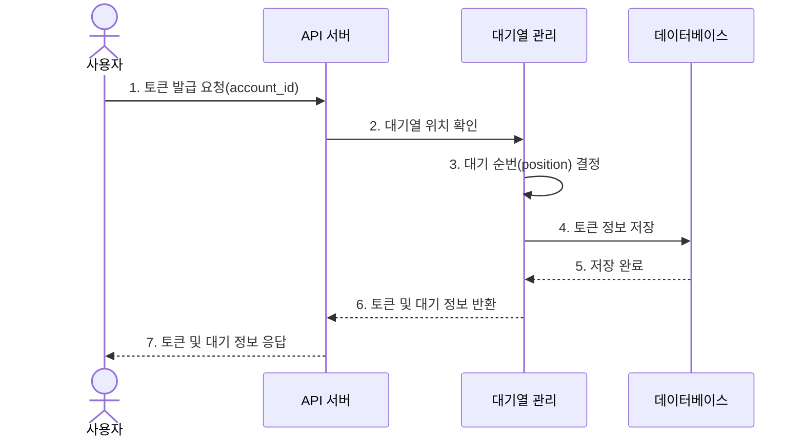

### 2. 예약 가능 날짜/좌석 API

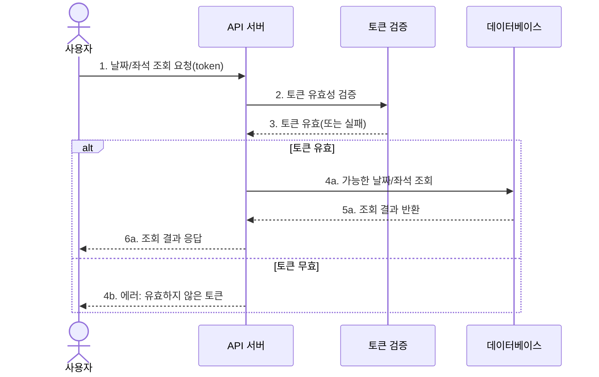

### 3. 좌석 예약 요청 API - 기본 흐름 (성공 시나리오)

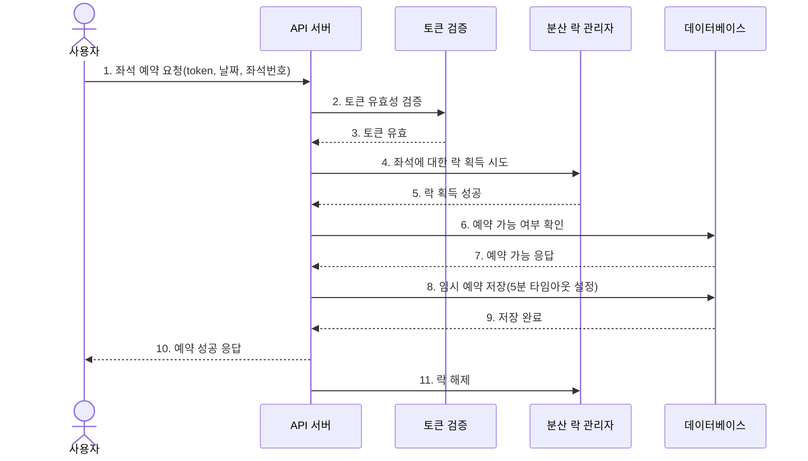

### 3-1. 좌석 예약 요청 API - 실패 시나리오 (토큰 무효)

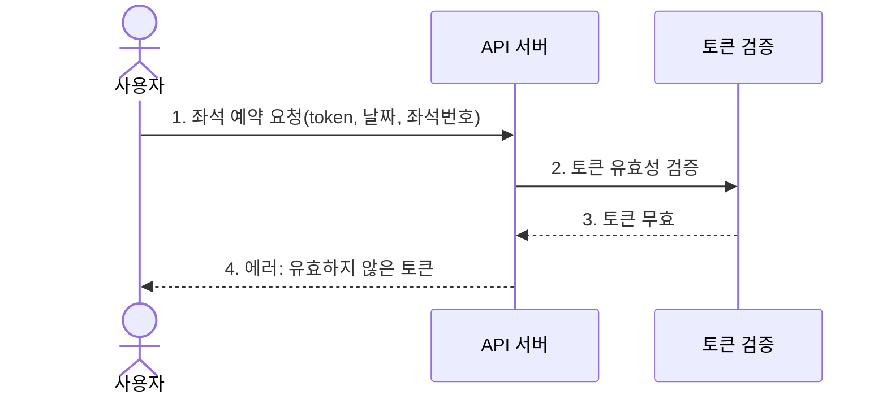

### 3-2. 좌석 예약 요청 API - 실패 시나리오 (락 획득 실패)

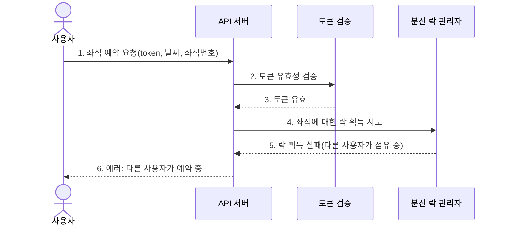

### 3-3. 좌석 예약 요청 API - 실패 시나리오 (이미 예약된 좌석)

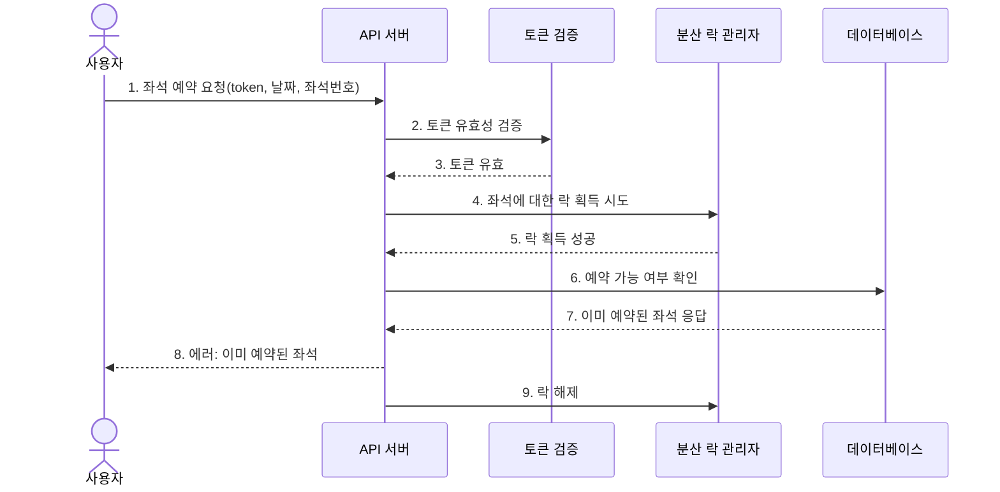

### 4. 잔액 충전/조회 API

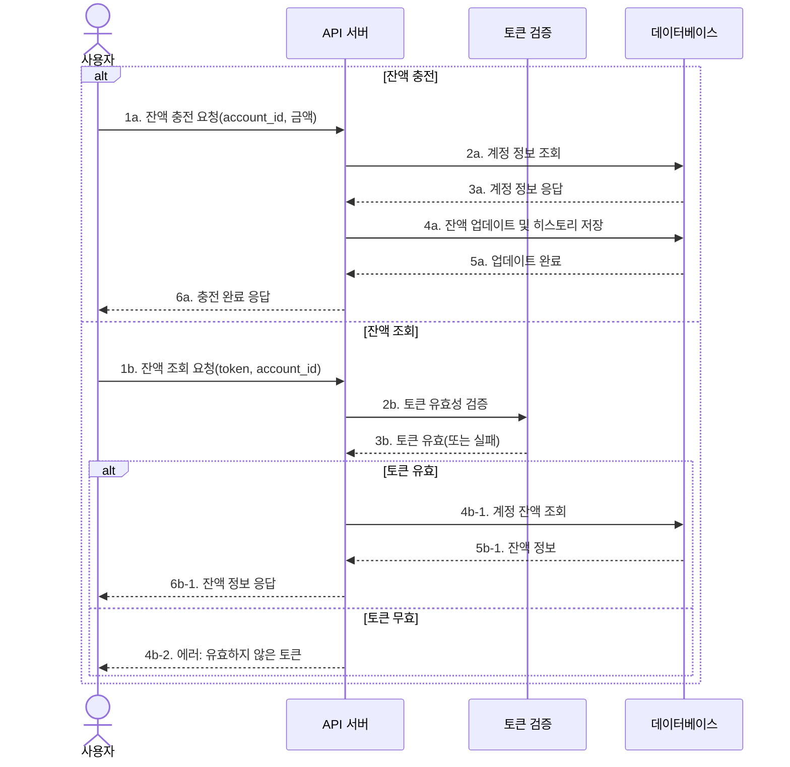

### 5. 결제 API - 기본 흐름 (성공 시나리오)

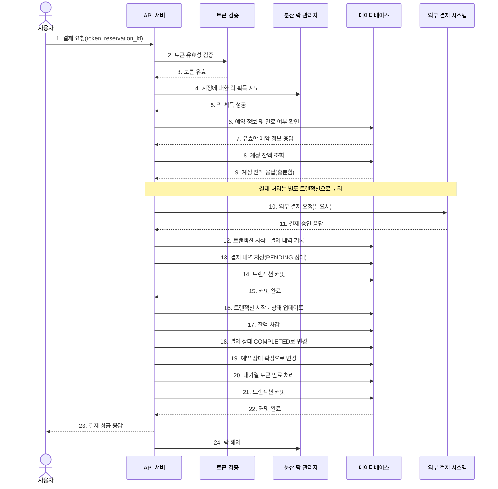

### 5-1. 결제 API - 실패 시나리오 (잔액 부족)

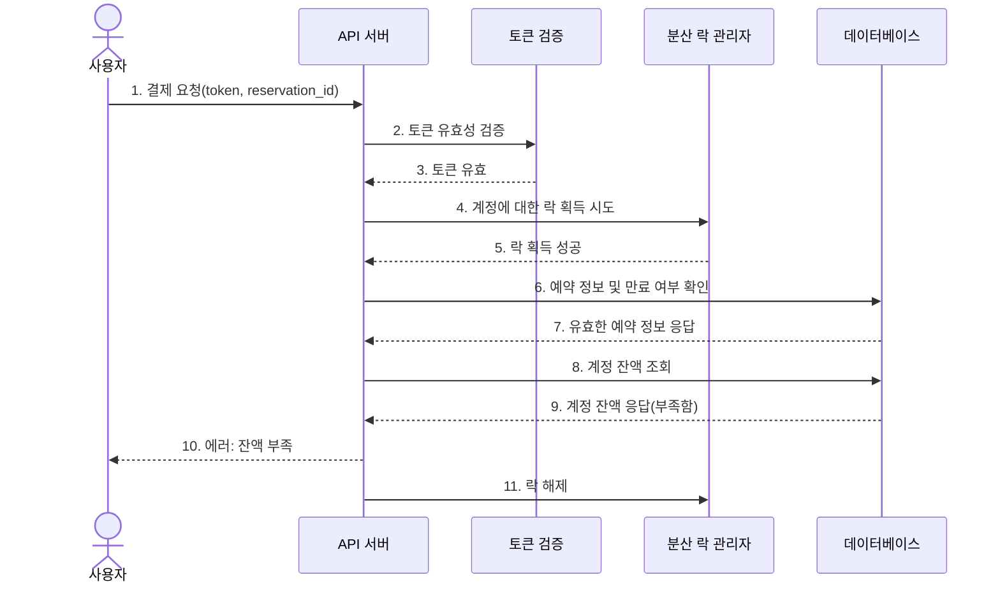

## 분산 락과 임시 배정 관리 전략

### 임시 예약 배정 관리

좌석 예약은 "임시 배정(PENDING)" 상태로 시작하며, 다음과 같은 전략으로 관리됩니다:

1. **TTL(Time-To-Live) 기반 관리**
   - 임시 예약은 생성 시 만료 시간(기본 5분)을 함께 설정
   - 만료 시간이 지난 후에도 결제되지 않은 예약은 자동으로 취소됨

2. **주기적 스케줄러 실행**
   - 별도의 스케줄러가 주기적으로(예: 1분마다) 실행되어 만료된 임시 예약을 확인
   - 만료된 예약은 자동으로 "만료(EXPIRED)" 상태로 변경되고 좌석은 다시 예약 가능하게 됨

```kotlin
// 예시: 만료된 예약 처리 스케줄러
@Scheduled(fixedDelay = 60000) // 1분마다 실행
fun processExpiredReservations() {
    val expiredReservations = reservationRepository.findExpiredReservations(Instant.now())
    
    expiredReservations.forEach { reservation ->
        reservation.markExpired()
        reservationRepository.save(reservation)
        log.info("Reservation expired: {}", reservation.id)
    }
}
```

3. **조회 시 만료 여부 확인**
   - 예약 조회 시마다 만료 여부를 검증하는 로직 포함
   - 사용자가 이미 만료된 예약으로 결제를 시도할 경우 즉시 실패 처리

### 분산 락 관리 전략

대규모 트래픽 환경에서 동시성 이슈를 방지하기 위한 분산 락 전략은 다음과 같습니다:

1. **Redis 기반 분산 락**
   - Redis의 `SETNX`와 만료 시간을 활용한 분산 락 구현
   - 재시도 메커니즘과 락 획득 타임아웃 설정으로 안정성 확보

2. **락 세분화**
   - 좌석별 락: `lock:seat:{scheduleId}:{seatId}`
   - 계정별 락: `lock:account:{accountId}`
   - 세분화된 락으로 불필요한 경합 최소화

3. **데드락 방지**
   - 모든 락에 최대 보유 시간 설정(예: 10초)
   - 락 획득 시도 최대 횟수 제한(예: 3회)

```kotlin
// 예시: Redis 기반 분산 락 사용
fun <T> executeWithLock(lockKey: String, timeoutMs: Long, task: () -> T): T {
    val lockValue = UUID.randomUUID().toString()
    val acquired = redisTemplate.opsForValue()
        .setIfAbsent(lockKey, lockValue, Duration.ofMillis(timeoutMs))
    
    if (acquired != true) {
        throw ConcurrentModificationException("Failed to acquire lock: $lockKey")
    }
    
    return try {
        task()
    } finally {
        // 락 해제: 본인이 설정한 락만 해제하도록 보장
        redisTemplate.execute(unlockScript, listOf(lockKey), lockValue)
    }
}
```

## 트랜잭션 처리와 결제 로직 전략

### 트랜잭션 분리 전략

결제 로직은 다음과 같이 트랜잭션을 분리하여 관리합니다:

1. **예약 정보 확인 트랜잭션**
   - 예약 정보 조회 및 상태 확인 (짧은 트랜잭션)

2. **결제 기록 트랜잭션**
   - 결제 내역을 PENDING 상태로 생성 (짧은 트랜잭션)

3. **외부 결제 시스템 연동**
   - 외부 API 호출은 트랜잭션 외부에서 처리
   - 비동기 처리 또는 이벤트 기반 아키텍처 적용 가능

4. **결제 완료 후 상태 업데이트 트랜잭션**
   - 잔액 차감, 결제 상태 변경, 예약 확정, 토큰 만료 처리 (짧은 트랜잭션)

### 보상 트랜잭션 처리

결제 과정에서 장애 발생 시 데이터 일관성을 유지하기 위한 보상 트랜잭션 전략:

1. **결제 상태 추적**
   - 모든 결제 단계의 상태 기록
   - 장애 발생 지점 파악 및 재시도/롤백 대응

2. **멱등성 보장**
   - 동일 결제 요청의 중복 처리 방지를 위한 요청 ID 활용
   - 실패한 트랜잭션의 안전한 재시도 지원

3. **결제 이벤트 기록**
   - 별도의 결제 이벤트 테이블에 모든 결제 관련 이벤트 기록
   - 장애 상황에서의 데이터 복구 및 감사 지원

## 인프라 구성도
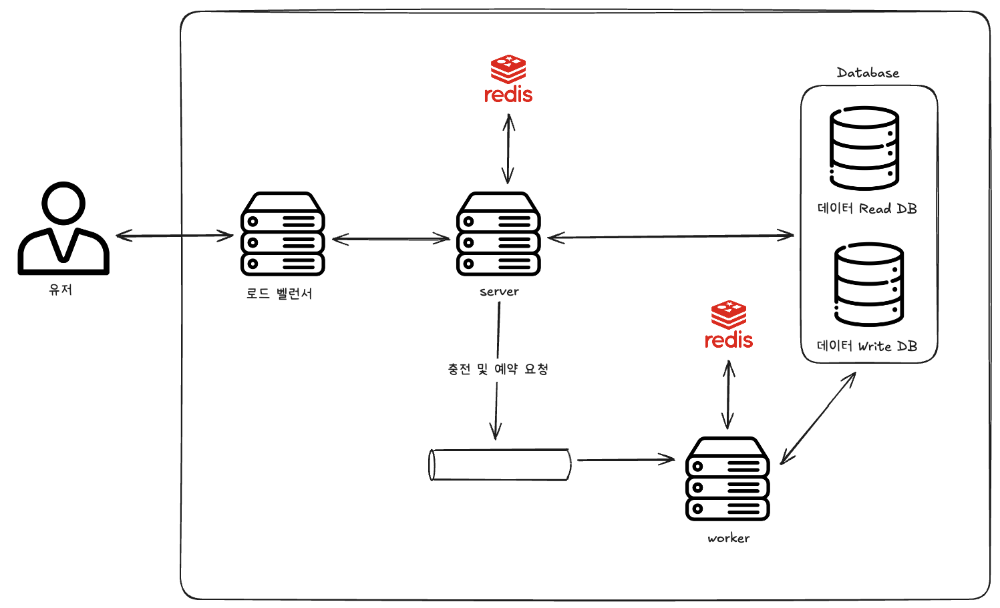
