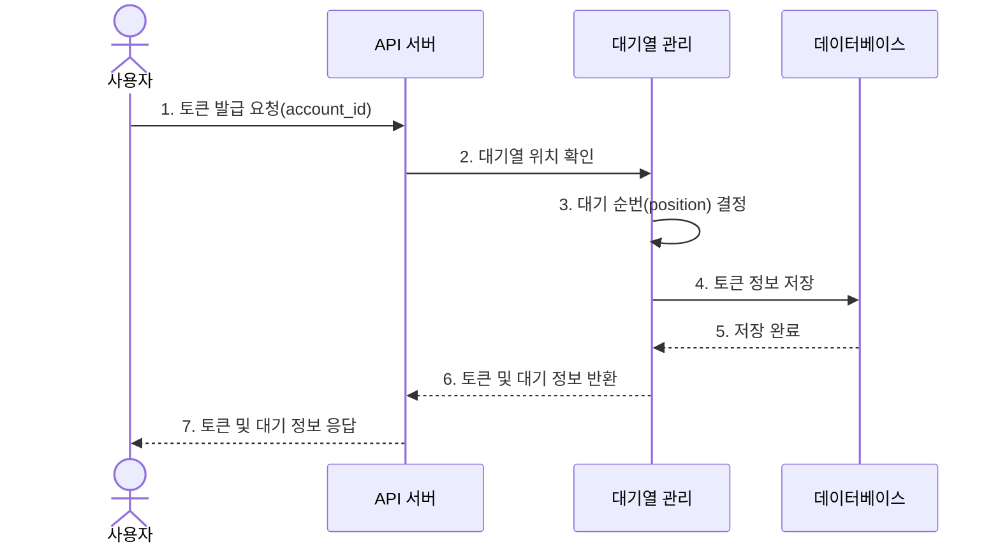
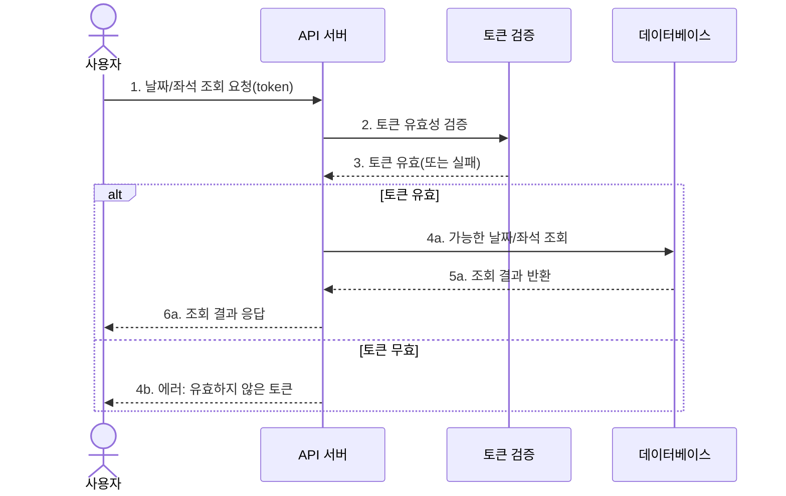
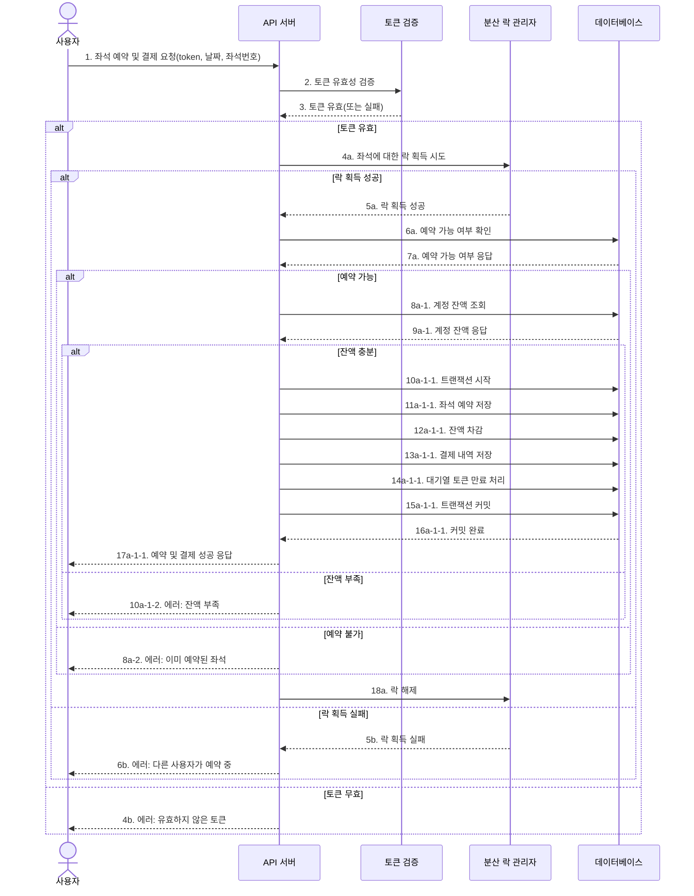
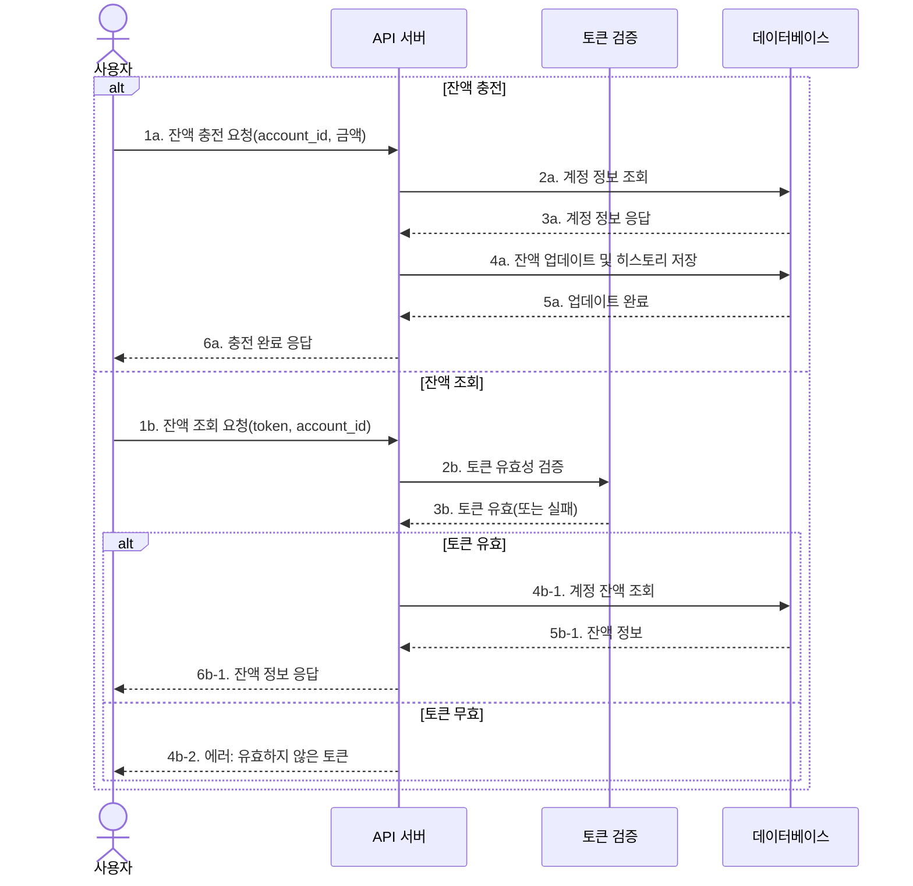

# 콘서트 예약 서비스 아키텍쳐

## ERD

```sql
-- 유저 계정 정보
CREATE TABLE ACCOUNT
(
   id         VARCHAR(64) PRIMARY KEY COMMENT '유저 고유 ID',
   email      VARCHAR(128) NOT NULL UNIQUE COMMENT '유저 이메일 (로그인용)',
   name       VARCHAR(64)  NOT NULL COMMENT '유저 이름',
   amount     INT          NOT NULL COMMENT '현재 잔액',
   created_at TIMESTAMP DEFAULT CURRENT_TIMESTAMP COMMENT '계정 생성 시각',
   updated_at TIMESTAMP DEFAULT CURRENT_TIMESTAMP ON UPDATE CURRENT_TIMESTAMP COMMENT '계정 수정 시각',
   unique (email)
) COMMENT='유저 계정';

-- 잔액 변동 내역
CREATE TABLE BALANCE_HISTORY
(
   id         BIGINT AUTO_INCREMENT PRIMARY KEY COMMENT '기록 ID',
   account_id VARCHAR(64) NOT NULL COMMENT '해당 유저 ID',
   amount     INT         NOT NULL COMMENT '변동 금액 (양수: 충전, 음수: 사용)',
   created_at TIMESTAMP DEFAULT CURRENT_TIMESTAMP COMMENT '변동 시각'
) COMMENT='잔액 변경 이력';

-- 대기열 토큰 관리 테이블
CREATE TABLE QUEUE_TOKEN
(
   token      VARCHAR(128) PRIMARY KEY COMMENT '랜덤 토큰 (UUID 등)',
   account_id VARCHAR(64) NOT NULL COMMENT '유저 ID',
   position   INT         NOT NULL COMMENT '대기열 내 순번',
   status     VARCHAR(32) NOT NULL COMMENT '대기열 상태',
   issued_at  TIMESTAMP DEFAULT CURRENT_TIMESTAMP COMMENT '토큰 발급 시각',
   ready_at   TIMESTAMP COMMENT 'READY 상태로 전환된 시각',
   expires_at TIMESTAMP COMMENT '토큰 만료 시각'
) COMMENT='대기열 토큰 정보';

-- 공연/행사 정보
CREATE TABLE EVENT
(
   id          BIGINT AUTO_INCREMENT PRIMARY KEY COMMENT '공연 ID',
   title       VARCHAR(255) NOT NULL COMMENT '공연 제목',
   description TEXT COMMENT '공연 설명',
   venue_id    BIGINT       NOT NULL COMMENT '공연 장소 ID',
   start_date  DATE         NOT NULL COMMENT '공연 시작일',
   end_date    DATE         NOT NULL COMMENT '공연 종료일',
   created_at  TIMESTAMP DEFAULT CURRENT_TIMESTAMP COMMENT '생성 시각',
   updated_at  TIMESTAMP DEFAULT CURRENT_TIMESTAMP ON UPDATE CURRENT_TIMESTAMP COMMENT '수정 시각'
) COMMENT='공연 정보';

-- 공연장(장소) 정보
CREATE TABLE VENUE
(
   id         BIGINT AUTO_INCREMENT PRIMARY KEY COMMENT '공연장 ID',
   name       VARCHAR(255) NOT NULL COMMENT '공연장 이름',
   address    VARCHAR(255) COMMENT '공연장 주소',
   capacity   INT          NOT NULL COMMENT '총 수용 가능한 좌석 수',
   created_at TIMESTAMP DEFAULT CURRENT_TIMESTAMP COMMENT '생성 시각',
   updated_at TIMESTAMP DEFAULT CURRENT_TIMESTAMP ON UPDATE CURRENT_TIMESTAMP COMMENT '수정 시각'
) COMMENT='공연장 정보';

-- 공연장의 좌석 정보
CREATE TABLE VENUE_SEAT
(
   id            BIGINT AUTO_INCREMENT PRIMARY KEY COMMENT '좌석 ID',
   venue_id      BIGINT      NOT NULL COMMENT '공연장 ID',
   seat_number   VARCHAR(16) NOT NULL COMMENT '좌석 번호 (예: A12, B5)',
   area         VARCHAR(64)  NOT NULL COMMENT '좌석 구역 (예: A구역, B구역)',
   seat_type     VARCHAR(32) NOT NULL COMMENT '좌석 유형',
   created_at    TIMESTAMP DEFAULT CURRENT_TIMESTAMP COMMENT '생성 시각',
   UNIQUE (venue_id, seat_number)
) COMMENT='공연장 좌석 정보';

-- 공연 회차 정보
CREATE TABLE EVENT_SCHEDULE
(
   id         BIGINT AUTO_INCREMENT PRIMARY KEY COMMENT '스케줄 ID',
   event_id   BIGINT NOT NULL COMMENT '공연 ID',
   date       DATE   NOT NULL COMMENT '공연 날짜',
   start_time TIME   NOT NULL COMMENT '공연 시작 시간',
   end_time   TIME COMMENT '공연 종료 시간',
   created_at TIMESTAMP DEFAULT CURRENT_TIMESTAMP COMMENT '생성 시각',
   UNIQUE (event_id, date, start_time)
) COMMENT='공연 회차 스케줄';

-- 특정 회차의 좌석 예약 정보
CREATE TABLE RESERVATION
(
   id          BIGINT AUTO_INCREMENT PRIMARY KEY COMMENT '예약 ID',
   schedule_id BIGINT      NOT NULL COMMENT '공연 스케줄 ID',
   seat_id     BIGINT      NOT NULL COMMENT '좌석 ID',
   account_id  VARCHAR(64) NOT NULL COMMENT '예약한 유저 ID',
   reserved_at TIMESTAMP DEFAULT CURRENT_TIMESTAMP COMMENT '예약 시각',
   UNIQUE (schedule_id, seat_id)
) COMMENT='좌석 예약 정보';
```

## 필수 기능 및 API
1. **유저 토큰 발급 API**
    - 유저의 UUID와 대기열 정보(순서, 잔여 시간 등)를 포함한 토큰 발급
    - 모든 API는 해당 토큰을 통해 대기열 검증 후 이용 가능
2. **예약 가능 날짜/좌석 API**
    - 예약 가능한 날짜 목록 조회
    - 날짜별 예약 가능한 좌석(1~50번) 조회
3. **좌석 예약 및 결제 API**
    - 날짜와 좌석 정보를 입력받아 예약 및 결제 처리
    - 유효한 토큰과 충분한 잔액 검증 후 좌석 소유권 배정
    - 결제 완료 시 대기열 토큰 만료 처리
4. **잔액 충전/조회 API**
    - 사용자 식별자 및 금액을 받아 잔액 충전
    - 사용자 식별자로 잔액 조회

## 시퀀스 다이어그램

### 1. 유저 토큰 발급 API



### 2. 예약 가능 날짜/좌석 API



### 3. 좌석 예약 및 결제 API



### 4. 잔액 충전/조회 API



## 인프라 구성도

