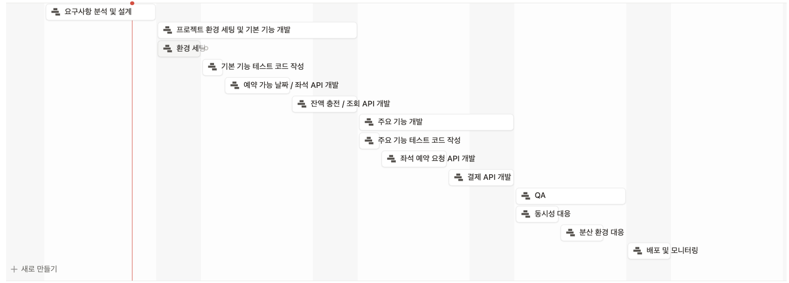

# Milestone

## 요구사항 분석
- 콘서트 좌석 예약을 위한 대기열 기반 예약 시스템 구현
- 사용자는 대기열 토큰을 발급받아야만 예약 서비스 이용 가능
- 좌석 예약 시 미리 충전한 잔액을 사용하며, 임시 배정 및 결제 시스템 포함

### 필수 기능 및 API
1. **유저 토큰 발급 API**
    - 유저의 UUID와 대기열 정보(순서, 잔여 시간 등)를 포함한 토큰 발급
    - 모든 API는 해당 토큰을 통해 대기열 검증 후 이용 가능
2. **예약 가능 날짜/좌석 API**
    - 예약 가능한 날짜 목록 조회
    - 날짜별 예약 가능한 좌석(1~50번) 조회
3. **좌석 예약 요청 API**
    - 날짜와 좌석 정보를 입력받아 임시 배정(약 5분, 정책 자율)
    - 임시 배정 시간 내 결제 미완료 시 배정 해제
    - 임시 배정 중에는 타 유저 예약 불가
    - 예약 처리 및 결제 내역 생성
    - 예약 완료 시 좌석 소유권 배정, 대기열 토큰 만료
4. **잔액 충전/조회 API**
    - 사용자 식별자 및 금액을 받아 잔액 충전
    - 사용자 식별자로 잔액 조회

### 시스템/기술 요구사항
- 각 기능별 단위 테스트 필수
- 다수 인스턴스 환경에서 동작 보장(분산 환경 동시성 고려)
- 대기열 및 좌석 임시 배정의 동시성 이슈 방지
- 대기열은 요청 순서대로 정확하게 제공되어야 함
- 좌석 중복 배정 불가
